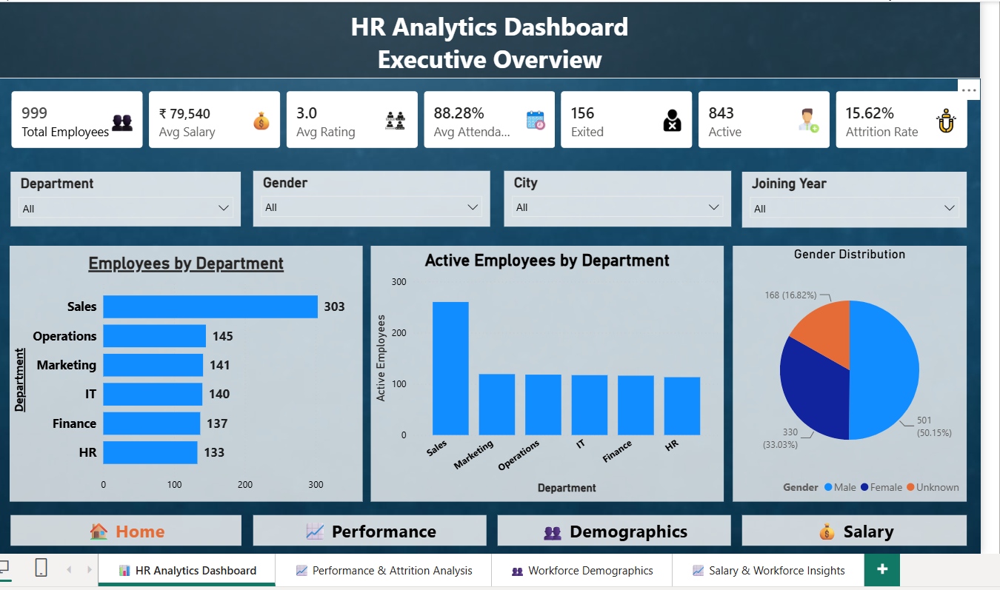
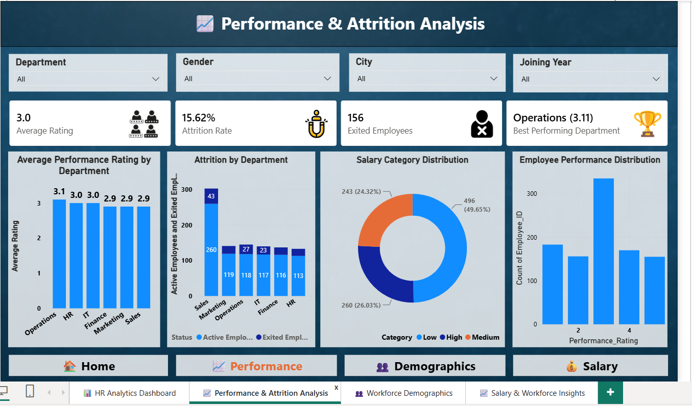
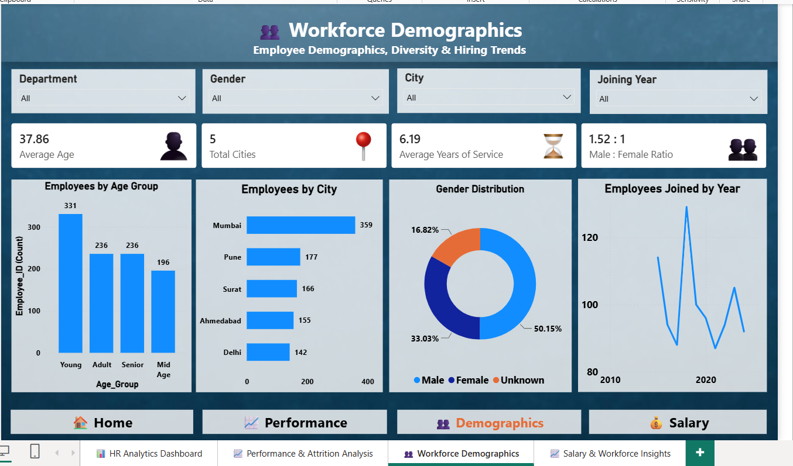
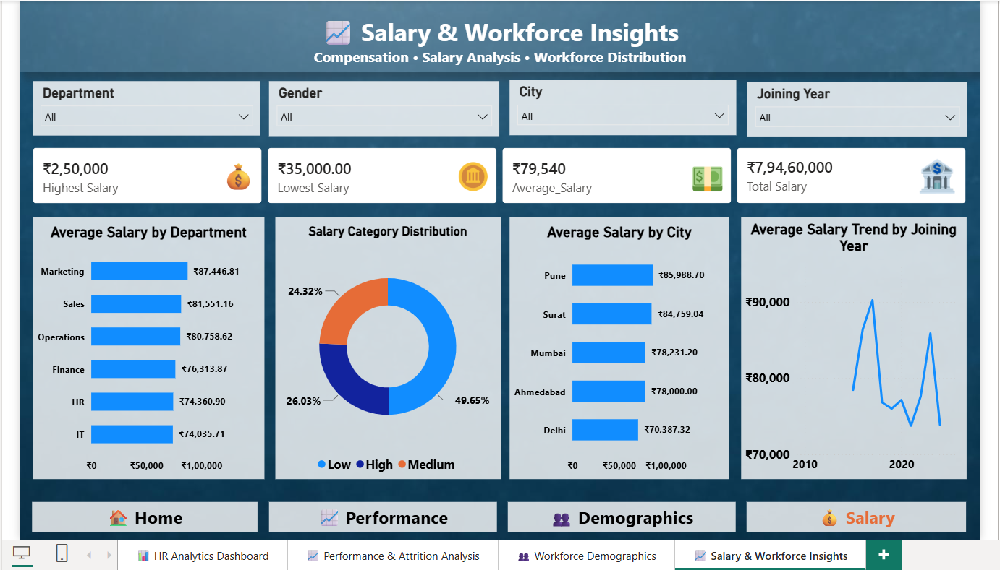

# 📊 HR Analytics Dashboard

A complete **HR Analytics Dashboard** built using **Power BI**, **Python**, and **DAX** to analyze employee data and provide business insights for HR decision-making.

---

# 🚀 Project Overview

Human Resource departments handle large volumes of employee data. This project transforms raw HR data into an interactive dashboard that helps management monitor workforce performance, employee demographics, attendance, attrition, and salary trends.

The dashboard enables HR managers to make data-driven decisions through interactive visualizations and KPIs.

---

# ❓ Problem Statement

Organizations often struggle to answer questions such as:

- Which department has the highest attrition?
- Which departments have the highest salaries?
- What is the average employee attendance?
- Which city has the most employees?
- How is employee performance distributed?
- What are the workforce demographics?

This dashboard provides answers to these questions in one place.

---

# 🛠 Tools & Technologies

- 📊 Power BI
- 🐍 Python
- 📈 Pandas
- 📉 Matplotlib
- 📋 DAX
- 🧹 Data Cleaning
- 📂 CSV Dataset

---

# 📁 Dataset

The dataset contains HR employee records including:

- Employee ID
- Gender
- Age
- Department
- City
- Salary
- Attendance
- Performance Rating
- Joining Date
- Exit Date
- Employment Status
- Attrition

---

# 📊 Dashboard Pages

### 🏠 Page 1 – HR Executive Overview

- Total Employees
- Active Employees
- Exited Employees
- Attrition Rate
- Average Salary
- Average Attendance
- Employee Distribution
- Department Analysis

---

### 📈 Page 2 – Performance & Attrition Analysis

- Performance Rating
- Attrition by Department
- Attrition Distribution
- Attendance Analysis
- Performance Comparison

---

### 👥 Page 3 – Workforce Demographics

- Gender Distribution
- Age Group Analysis
- City-wise Employees
- Department-wise Employees
- Workforce Composition

---

### 💰 Page 4 – Salary & Workforce Insights

- Salary Distribution
- Department Salary Comparison
- Average Salary by Department
- Workforce KPIs

---

# 📌 Key KPIs

- 👥 Total Employees
- ✅ Active Employees
- 🚪 Exited Employees
- 💰 Average Salary
- 📅 Average Attendance
- ⭐ Average Performance Rating
- 📉 Attrition Rate

---

# 📂 Project Structure

```
HR-Analytics-Dashboard-PowerBI
│
├── Dashboard
│   └── HR Executive Dashboard.pbix
│
├── Dataset
│   ├── hr_data.csv
│   └── clean_hr_data.csv
│
├── Python
│   ├── analysis.py
│   ├── eda.py
│   ├── utils.py
│   ├── visualization.py
│   ├── insights.txt
│   ├── README.md
│   └── HR_Analytics_Project
│
├── Screenshots
│   ├── Page1_Executive_Overview.png
│   ├── Page2_Performance_Analysis.png
│   ├── Page3_Workforce_Demographics.png
│   └── Page4_Salary_Workforce_Insights.png
│
└── README.md
```

---

# 📸 Dashboard Preview

## 🏠 Page 1 - HR Executive Overview



---

## 📈 Page 2 - Performance & Attrition Analysis



---

## 👥 Page 3 - Workforce Demographics



---

## 💰 Page 4 - Salary & Workforce Insights



---

# 💡 Key Business Insights

- Sales department has the highest number of employees.
- HR department has the lowest workforce size.
- Average attendance is above 88%.
- Attrition rate is approximately 15%.
- Marketing has the lowest attendance.
- Employee distribution varies significantly across departments.
- Salary trends help identify compensation differences between departments.

---

# 🧹 Data Cleaning Process

Python was used for:

- Removing duplicate records
- Handling missing values
- Standardizing gender values
- Creating Age Groups
- Converting date columns
- Exploratory Data Analysis (EDA)
- Generating visualizations
- Exporting cleaned dataset for Power BI

---

# ▶️ How to Run

### Clone Repository

```bash
git clone https://github.com/gauravgith-a11y/HR-Analytics-Dashboard-PowerBI.git
```

### Open Power BI Dashboard

```
Dashboard/
```

Open:

```
HR Executive Dashboard.pbix
```

### Python Analysis

Install dependencies

```bash
pip install pandas matplotlib
```

Run

```bash
python analysis.py
```

---

# 🎯 Skills Demonstrated

- Data Cleaning
- Exploratory Data Analysis (EDA)
- Data Visualization
- Dashboard Design
- Power BI
- DAX
- Python
- Pandas
- Business Intelligence
- KPI Reporting

---

# 👨‍💻 Author

**Kushagra Dhamani**

📧 Email: kushdhamani@gmail.com

🔗 GitHub:

---

## ⭐ If you found this project useful, don't forget to Star this repository!
